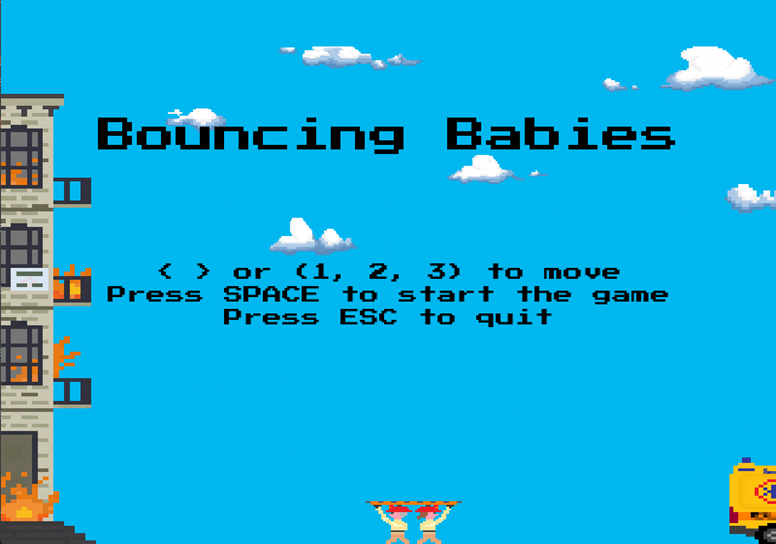
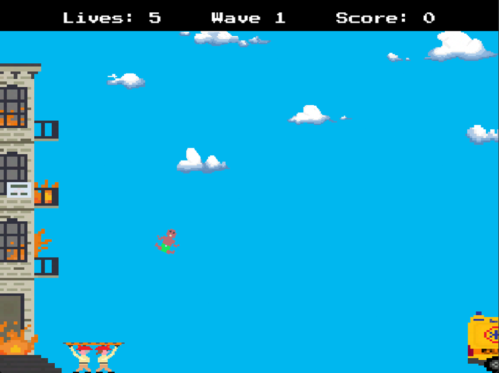
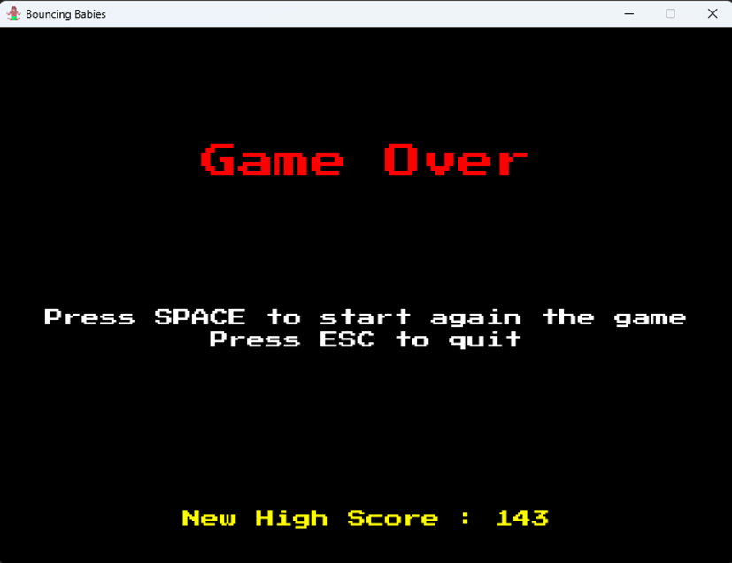

# Bouncing Babies
A semester project for the university course *Graphics* written in Python with the Pygame library 

## Project Description
Based on the game [Bouncing Babies](https://www.youtube.com/watch?v=5CdB8y3GHvs).

The goal is to save babies falling from a burning building using the firefighters to move the trampoline and bounce the babies into the ambulance

## Controls

- Move Firefighters
    - Arrow keys [<-, ->]
    - Keys [A, D] or [L1, R1]
    - Numbers [1, 2, 3] for each corresponding position
- Supports keyboard and PS4 controller

## Game Rules
- Start with 5 lives on wave 1
- Each baby safely delivered on the ambulance = +1 to the score counter
- Each failed attempt = -1 life
- Every 10 points = next wave (speed +5)
- Every 25 points = +1 life (max 5)
- When lives reach 0 = Game Over
- High Score is saved per session

## Assets

- All sprites and visual assets used in the game were created by me.
- Audio files are excluded from this repository due to copyright and licensing restrictions.

## Screenshots
 

 

 
